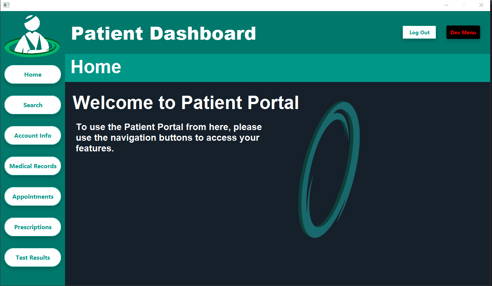

# PATIENT PORTAL Medical Database Manager

Computer Programming and Information Systems Senior Project

(FSC-BCS-430W: Senior Project)

## Summary

Patient Portal is a comprehensive application designed to manage a medical database for doctors, patients, and support services like test centers and pharmacies.

The app provides a unique dashboard for each user-type upon login, activating relevant features tailored to that user. 

Depending on the features enabled by the user-type, users can manipulate records for personal information, medical history, appointments, prescriptions, and test results.

## Assignment Context

This application was the product of a semester long development as the overall senior capstone project for my CPIS degree. 

The goal was to take a team of five students through the SDLC and develop an original application from scratch, taking everything we've learned from all previous programming classes.

The only requirements were to have an easy to use UI, and to use MS SQL Server as a database. 

To fulfill these requirements, my team I created a medical database and patient portal. 

This project was made using MS SQL Server, and written with Java in Apache Netbeans.

## Features
- **Login**: Determines the user type and directs them to the appropriate dashboard.
- **Register**: Creates an account after the user enters personal info. 
- **Home**: Home page shortcut to greet users upon login.
- **Search**: Allows doctors to search for patients and services, while patients can search for doctors and services.
- **Account Info**: A personal info manager to update contact info, addresses, and insurance info.
- **Medical Records**: A database of appointment and diagnostic history.
- **Appointments**: A feature to create, update, and cancel appointments.
- **Prescriptions**: A prescription manager for doctors to prescribe medication, and for patients and servies to view details.
- **Test Results**: A test manager for doctors to order tests, for services to send results, and for patients to view results.
- **Log Out**:
- **Dev Menu**:

## How it Works

### Login and Registration

This feature authenticates users and redirects them to the corresponding dashboard (doctor, patient, or service) based on their user type. 
Users can also create accounts and enter their personal info for the first time depending on the user type.

#### Login Process

The login page is the first screen that users see when they access the application. It has two main fields:

- **Username**: Users enter their username in this field.
- **Password**: Users enter their password in this field.

Once the username and password are entered, users can click on the "LOGIN" button to access their respective dashboards. If the entered credentials are incorrect, an error message is displayed. 

Users can also navigate to the registration page by clicking on the "REGISTER" button.

#### Registration Process

The registration process is initiated from the login page by clicking on the "REGISTER" button. This takes the user to a registration page where they can provide their details. The registration page contains the following fields:

- **Username**: The desired username.
- **Password**: The desired password.
- **Email**: The user's email address.
- **Type**: The type of user. Options include "Patient", "Doctor", "Lab", "Pharmacy", and "Office".

Upon filling out these fields and selecting the user type, users are directed to a second registration page tailored to their user type:

- **Patient Registration**: Additional fields for first name, last name, phone number, email, address, city, state, zip code, insurance ID, and insurance provider.
- **Doctor Registration**: Additional fields for first name, last name, phone number, email, degree, and specialty.
- **Service (Lab, Pharmacy, Office) Registration**: Additional fields for name, fax number, phone number, email, address, city, state, and zip code.

After filling out these fields, the user's information is saved in the database, and they are redirected to the login page. They can then login using the username and password they registered with.

In all cases, if the user leaves a field empty, an error message prompts them to fill in all fields.

### Home & Tabs

The home page serves as the main dashboard once a user is logged in. 
It's tailored to the specific type of user, with different colors, title, top left corner logo, and sometimes different buttons depending on the features enabled to the specific user. 

Along the left side, there are several tabs for navigating the application, including Home, Search, Account Info, Medical Records, Appointments, Prescriptions, and Test Results. 
The "Home" tab serves as a shortcut to return to their respective home page from any other part of the application. 
The other tabs allow the user to navigate to various features of the application. 
Each tab corresponds to a specific feature, and clicking on the tab will navigate to that feature. 
The specific functionalities and permissions may vary depending on the user type.

While some users may have the same tabs as others, the color, title, and logo will stay the same for the user type that is currently logged in.

### Search

The Search feature is accessible from the main dashboard and varies depending on the user type.
The first page of the search feature allows users to choose which database they want to search in. 
The options are:

- **Patients**: This button is only available to doctors to search for patients.
- **Doctors**: This button is only available to patients to search for doctors.
- **Pharmacy**: This button is available to both patients and doctors to search for pharmacies.
- **Labs**: This button is available to both patients and doctors to search for labs.

Service users do not have access to the search feature.

The second page of the search feature presents the search results, along with a refresh button to check for database updates. 

The data, functionality, and permissions may vary depending on the user type.

- **Doctors** can search for patients and have the ability to delete and update patient records from the search results.
- **Patients** can search for doctors but cannot delete or update doctor records from the search results.

### Account Info
The Account Info tab allows users to update their contact information, addresses, and insurance information. 

### Medical Records
Medical records are a collection of appointment and diagnostic history. Doctors can access all their patients' information and create new records, while patients can only view their own records.

### Appointments
The appointments tab allows doctors, patients, and service staff to create, update, and cancel appointments. 

### Prescriptions
The prescriptions tab displays a list of prescriptions. Doctors can create prescriptions, while patients can only view their own prescriptions.

### Test Results
The test results tab shows a list of test results. Doctors can create and view test results for their patients, while patients can only view their own test results.
