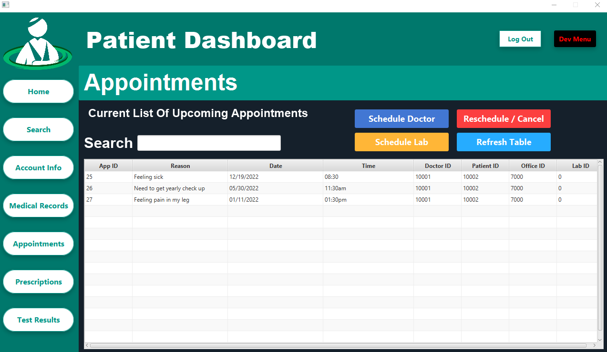
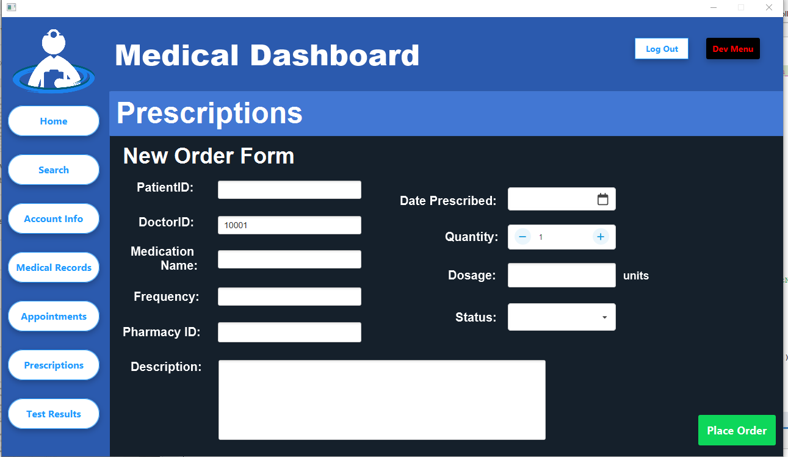

# PATIENT PORTAL Medical Database Manager

Computer Programming and Information Systems Senior Project

(FSC-BCS-430W: Senior Project)

## Table of Contents

- [Summary](#summary)
- [Technologies](#technologies)
- [Setup](#setup)
  * [Prerequisites](#prerequisites)
  * [Instructions](#instructions)
- [Features](#features)
- [Users](#users)
  * [Patients](#patients)
  * [Doctors](#doctors)
  * [Service Users (Labs/Pharmacies)](#service-users-labspharmacies)
- [How it Works](#how-it-works)
  * [Login and Registration](#login-and-registration)
    + [Login Process](#login-process)
    + [Registration Process](#registration-process)
  * [Home & Tabs](#home--tabs)
  * [Search](#search)
  * [Account Info](#account-info)
  * [Medical Records](#medical-records)
  * [Appointments](#appointments)
  * [Prescriptions](#prescriptions)
  * [Test Results](#test-results)
- [Status](#status)
- [Credits](#credits)

## Summary

Patient Portal is a comprehensive application designed to manage a medical database for doctors, patients, and support services like test centers and pharmacies.

The app provides a unique dashboard for each user-type upon login, activating relevant features tailored to that user. 

Depending on the features enabled by the user-type, users can manipulate records for personal information, medical history, appointments, prescriptions, and test results.

This application was the product of a semester long development as the overall senior capstone project for my CPIS degree. 

The goal was to take a team of five students through the SDLC and develop an original application from scratch, taking everything we've learned from all previous programming classes.

To fulfill the requirements, my team I created a medical database and patient portal. 

## Technologies
- **Apache Netbeans** primary IDE
- **Java** backend programming language
- **FXML** frontend markup language
- **MS SQL Server** relational database
- **MaterialFX** enhanced modern UI components library

## Setup

### Prerequisites:

1. **Java Development Kit (JDK)**
   - Version: 1.8 (Java 8) or higher
   - [Download Link](https://www.oracle.com/java/technologies/downloads/#java8)
   
2. **Apache Maven**
   - Version: 3.x
   - [Download Link](https://maven.apache.org/download.cgi)
   
3. **Microsoft SQL Server**
   - Ensure you have a running instance of Microsoft SQL Server to connect to.
   - The application is configured to use the JDBC driver for Microsoft SQL Server.
   - [Download Link](https://www.microsoft.com/en-us/sql-server/sql-server-downloads)
  
### Instructions:

1. **Clone the repository**

2. **Compile and build the project**

3. **Microsoft SQL Server Configuration:**
   - Ensure you have a running instance of Microsoft SQL Server to connect to.
   - Ensure that these credentials have the necessary permissions on your SQL Server instance.
   - (default database username is pportal and the password is admin)
   - Update the DatabaseConnection.java class if you need to modify the connection string
   - Ensure that your SQL Server allows connections on the specified port.
   -  nsure that any firewalls or security groups are configured to allow the application to connect.
  
4. **Run the application**

## Features
- **Login**: Determines the user type and directs them to the appropriate dashboard.
- **Register**: Creates an account after the user enters personal info. 
- **Home**: Home page shortcut to greet users upon login.
- **Search**: Allows doctors to search for patients and services, while patients can search for doctors and services.
- **Account Info**: A personal info manager to update contact info, addresses, and insurance info.
- **Medical Records**: A database of appointment and diagnostic history.
- **Appointments**: A feature to create, update, and cancel appointments.
- **Prescriptions**: A prescription manager for doctors to prescribe medication, and for patients and servies to view details.
- **Test Results**: A test manager for doctors to order tests, for services to send results, and for patients to view results.
- **Log Out**: Signs out the current user and redirects to the login page. 
- **Dev Menu**: Used for development, testing, and presentation purposes only. This should be removed or disabled in any production version of this application.

## Users

Each user type has a specific dashboard and set of features tailored to their role in the healthcare system, allowing them to interact with the system according to their needs and responsibilities. 
By segregating the functionalities based on the users role, the design provides a more personalized and secure user experience.

### Patients:
- Patients can view their own medical records, prescriptions, test results, and appointments.
- They can schedule appointments with doctors or labs.
- They can search for doctors, pharmacies, and labs.
- Their dashboard provides them with various options to navigate through their healthcare-related information.

### Doctors:
- Doctors have access to patients' medical records and can perform CRUD (Create, Read, Update, Delete) operations on them.
- They can view test results and prescriptions but have specific access to prescribe medications.
- Doctors can search for patients, pharmacies, and labs.
- They have access to functionalities such as inserting, deleting, and updating medical records and appointments, and can print medical records.
- The medical dashboard caters to the doctor users as well as nurses and or any aiding technicians. 

### Service Users (Labs/Pharmacies):
- Service Users seem to represent entities such as labs or pharmacies.
- They have unique functionalities related to handling test results. Specifically, they can add, update, delete, and view test results.
- The dashboard for service users focuses on managing and displaying test results.

## How it Works

### Login and Registration

This feature authenticates users and redirects them to the corresponding dashboard (doctor, patient, or service) based on their user type. 
Users can also create accounts and enter their personal info for the first time depending on the user type.

#### Login Process

The login page is the first screen that users see when they access the application. It has two main fields:

- **Username**: Users enter their username in this field.
- **Password**: Users enter their password in this field.

Once the username and password are entered, users can click on the "LOGIN" button to access their respective dashboards. If the entered credentials are incorrect, an error message is displayed. 

Users can also navigate to the registration page by clicking on the "REGISTER" button.

#### Registration Process

The registration process is initiated from the login page by clicking on the "REGISTER" button. This takes the user to a registration page where they can provide their details. The registration page contains the following fields:

- **Username**: The desired username.
- **Password**: The desired password.
- **Email**: The user's email address.
- **Type**: The type of user. Options include "Patient", "Doctor", "Lab", "Pharmacy", and "Office".

Upon filling out these fields and selecting the user type, users are directed to a second registration page tailored to their user type:

- **Patient Registration**: Additional fields for first name, last name, phone number, email, address, city, state, zip code, insurance ID, and insurance provider.
- **Doctor Registration**: Additional fields for first name, last name, phone number, email, degree, and specialty.
- **Service (Lab, Pharmacy, Office) Registration**: Additional fields for name, fax number, phone number, email, address, city, state, and zip code.

After filling out these fields, the user's information is saved in the database, and they are redirected to the login page. They can then login using the username and password they registered with.

In all cases, if the user leaves a field empty, an error message prompts them to fill in all fields.

### Home & Tabs

The home page serves as the main dashboard once a user is logged in. 

It's tailored to the specific type of user, with different colors, title, top left corner logo, and sometimes different buttons depending on the features enabled to the specific user. 

Along the left side, there are several tabs for navigating the application, including Home, Search, Account Info, Medical Records, Appointments, Prescriptions, and Test Results. 

The "Home" tab serves as a shortcut to return to their respective home page from any other part of the application. 

The other tabs allow the user to navigate to various features of the application. 

Each tab corresponds to a specific feature, and clicking on the tab will navigate to that feature. 

The specific functionalities and permissions vary depending on the user type.

While some users will have the same tabs as others, the color, title, and logo will stay the same for the user type that is currently logged in.

### Search

The Search feature is accessible from the main dashboard and varies depending on the user type.

Service users do not have access to the search feature.

The first page of the search feature allows users to choose which database they want to search in. 
The options are:

- **Patients**: This button is only available to doctors to search for patients.
- **Doctors**: This button is only available to patients to search for doctors.
- **Pharmacy**: This button is available to both patients and doctors to search for pharmacies.
- **Labs**: This button is available to both patients and doctors to search for labs.

The second page of the search feature presents the search results, along with a refresh button to check for database updates. 

The data, functionality, and permissions vary depending on the user type.

- **Doctors** can search for patients and have the ability to delete and update patient records from the search results.
- **Patients** can search for doctors but cannot delete or update doctor records from the search results.

### Account Info

Users can access the this feature by clicking on the "Account Info" tab on the dashboard's left side. 

The Account Info feature provides users with a detailed view of their account information, allowing them to see and manage their personal details. 

The user can update their account information by modifying the values in the text fields and clicking the "Update" button. 

The system will update the user's details in the database and show a confirmation message.

The layout and functionalities vary depending on the user type.

In the case of the image shown, patients have an additional feature for emergency contacts.

- **Refresh**: The user can click the "Refresh" button to refresh the Emergency Contacts table.
- **Add**: Clicking the "Add" button opens a new window where the user can add a new emergency contact.
- **Delete**: Clicking the "Delete" button opens a new window where the user can remove an emergency contact.

### Medical Records

The Medical Records panel can be accessed by clicking on the "Medical Records" button on the dashboard's left side. 

The "Medical Records" feature is a vital part of the healthcare application, providing medical professionals with the tools to handle patient medical records efficiently and effectively. 

Its rich set of functionalities ensures that medical information is easily accessible, up-to-date, and manageable.

This feature enables doctors to access, manage, and manipulate patient medical records.

Only doctors can access all their patients' information and create new records, while patients can only view their own records.

This section of the app provides a detailed view of the medical history of patients, along with functionalities to add, update, delete, search, refresh, and print medical records.

- **Insert**: By clicking the "Insert" button, users can open a new window to insert a new medical record into the system.
- **Update**: By clicking the "Update" button, users can open a new window to update existing medical records.
- **Delete**: By clicking the "Delete" button, users can open a new window to delete a selected medical record.
- **Refresh**: By clicking the "Refresh" button, users can reload the medical records table to reflect any changes.
- **Print**: By clicking the "Print" button, users can open a new window to print the medical records table.

The search bar is provided to facilitate the search through the medical records table. 

Users can input text into the search field, and the table will filter the results based on the input. 

The search function considers multiple attributes such as Record ID, Patient ID, DOB, Record Date, Height, Weight, Blood Type, and Diagnosis.

### Appointments

Users can access the this feature by clicking on the "Appointments" button on the users's dashboard.

The "Appointments" feature provides a user-friendly interface for managing appointments, allowing patients and doctors to easily schedule, reschedule, cancel, and view their appointments. 

By consolidating all appointment-related tasks into one panel, the feature offers a convenient and efficient way for users to manage their healthcare scheduling needs.

This feature provides various functionalities including scheduling, rescheduling, canceling, and viewing existing appointments.

A "Refresh Appointments" button has been conveniently included to ensure that the displayed information is always up to date.

#### Scheduling, Rescheduling, or Canceling Appointments

Patients can schedule appointments with doctors or labs using the following options:

- **Schedule Doctor Appointment**: By clicking this button, patients are redirected to a new window where they can fill out the necessary details to schedule an appointment with a doctor.
- **Schedule Lab Appointment**: Similar to scheduling a doctor appointment, this button redirects patients to a new window where they can schedule an appointment with a lab.
- **Reschedule or Cancel Appointment**: Patients can use this button to reschedule or cancel any existing appointment. Clicking this button opens a new window where they can make the necessary changes.

#### Viewing Appointments
The appointments table provides an overview of all existing appointments, displaying information such as:

- **Appointment ID**: A unique identification number for the appointment.
- **Reason**: The reason for the appointment.
- **Date**: The scheduled date of the appointment.
- **Time**: The scheduled time of the appointment.
- **Doctor ID**: The identification number of the associated doctor (if applicable).
- **Patient ID**: The identification number of the patient.
- **Office ID**: The identification number of the associated office (if applicable).
- **Lab ID**: The identification number of the associated lab (if applicable).

### Prescriptions

The Prescriptions panel can be accessed by clicking the "Prescriptions" button on the users's dashboard. 

The "Prescriptions" feature streamlines the medication prescribing process, providing an efficient way for doctors to order medications for patients and manage existing prescriptions.

Patients and service users can view this information, while only doctors have the ability to write new prescriptions.

Doctors can write a new prescription by filling in the following fields:

- **Medication**: Name of the medication being prescribed.
- **Description**: A brief description of the medication and its purpose.
- **Date**: The date of the prescription using a date picker.
- **Patient ID**: The identification number of the patient to whom the medication is prescribed.
- **Pharmacy ID**: The identification number of the pharmacy responsible for fulfilling the prescription.
- **Doctor ID**: Automatically filled with the doctor's identification number.
- **Status**: A drop-down menu (combo box) that allows selection of the prescription's status, including options like "Processing," "Cancelled," "Refill."
- **Frequency**: Instructions on how often the medication should be taken.
- **Dosage**: The prescribed dosage of the medication.
- **Quantity**: A spinner to select the quantity of medication prescribed.

Once the form is filled, the doctor can click the "Order" button to place the prescription order. Upon successful placement, a confirmation message is displayed.

### Test Results

The "Test Results" feature enables service users (ie labs) to manage medical test results efficiently, providing an interface to add new results and view existing ones. 

By consolidating all test-related tasks into one panel, it offers a streamlined process for handling this critical aspect of medical care.

Patients can view these results, similar to Medical Records, but only doctors and service users have full CRUD (Create, Read, Update, Delete) access. 

The main panel displays a table containing the test results. Information in the table includes:

- **Test Result ID**: A unique identifier for the test result.
- **Title**: The title or name of the test.
- **Result**: The outcome or value of the test.
- **Date**: The date the test result was recorded.
- **Type**: The type or category of the test.
- **Patient ID**: The identification number of the patient associated with the test.
- **Lab ID**: The identification number of the lab where the test was conducted.
- **Name**: The name of the lab.
- **City**: The city where the lab is located.

Doctors and service users can add new test results by following these steps:

- **Click the "Add" Button**: This opens a new panel where the user can input the test result details.
Enter the Details: The user must enter the necessary information, including Lab ID, Patient ID, Title, Type, Date, and Result.
- **Click the "Insert" Button**: This adds the new test result to the database and displays a success message.
- **Click the "Back" Button**: This returns the user to the main Test Results panel, where the newly added result is visible.

All users have access to the refresh button"
- **Click the "Refresh" Button**: This refreshes the test results table, ensuring that the displayed information is up to date.

## Status

This project originated as a culmination of academic endeavors during the spring semester of 2022. Developed as the capstone senior project, it represents the integration and application of skills and knowledge acquired over the course of college studies.

The project journeyed through the Software Development Life Cycle (SDLC), from requirements gathering to deployment. Its development phase concluded with a presentation in May 2022 to faculty members, where it not only met but exceeded expectations. Receiving full marks, the project was distinguished as the highest-scoring amongst its peers.

Following the successful demonstration and subsequent accolades, the decision was made to mark the project's status as "completed." This signifies that, as of the presentation in May 2022, no further development or iterations are planned, marking its lifecycle's conclusion.

## Credits
